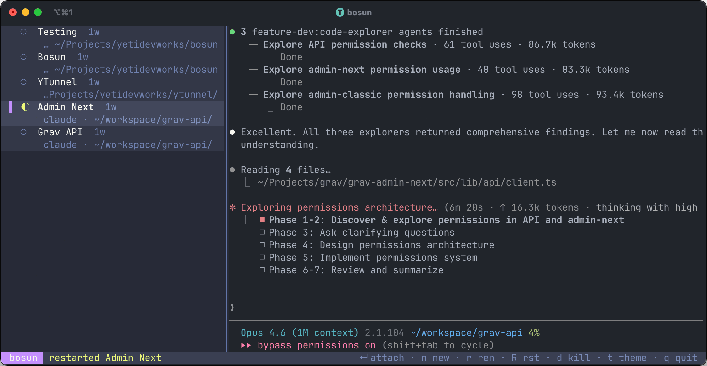

# Bosun



Tmux-native orchestrator for AI agent sessions. Written in Rust with
[ratatui](https://ratatui.rs/).

Bosun lists, previews, creates, and manages tmux sessions running AI coding
agents (Claude Code, Codex, or a plain shell) from a single terminal UI. It
was built as a from-scratch reimagining of
[agent-deck](https://github.com/yetidevworks/agent-deck) — same workflow, new
architecture, designed around a few rules that keep it simple and robust:

- **Tmux is the source of truth.** Bosun receives push notifications from
  tmux via control mode (`tmux -C`). No shared database state to race on;
  multi-instance coexistence is trivial because every bosun reads the same
  tmux server.
- **Actor pattern, single-writer app state.** One task owns tmux I/O, one
  task owns `AppState`. No nested mutexes, no `Arc<Mutex<...>>` scattered
  across the render path.
- **Dedicated tmux socket.** Bosun runs its sessions on `tmux -L bosun` by
  default so it never touches your other tmux state, and so Claude Code's
  macOS Keychain auth lineage flows through bosun's process tree correctly.
- **Per-session status bar.** Bosun writes its status line with
  `set-option -t <session>`, never globally, so non-bosun sessions on the
  same server are untouched.
- **Opencode aesthetic.** Borderless, subtly shaded panels, bold accents,
  modal dialogs with left accent bars and drop shadow. Ten built-in themes
  to pick from (opencode, tokyonight, dracula, catppuccin-mocha,
  one-dark-pro, ayu-mirage, nord, gruvbox-dark, rose-pine, github-dark),
  switched live with `t`.

## Features

- Live session list with smoothed status detection
  (`●` running · `◐` waiting · `○` idle · `✕` error) and pane preview
- Create new bosun-managed sessions from a modal form: name, path, agent
  choice, and agent-specific options (Claude `--continue` / `--resume` /
  skip-permissions, Codex `--yolo`)
- Filesystem tab-completion in the path field (shell-style LCP matching
  against live directory contents)
- Recent sessions picker (`Ctrl+R` from the new-session modal) backed by
  SQLite, with live substring filter and delete-from-list
- Session lifecycle: attach (`Enter`), rename (`r`), restart (`R`), kill (`d`)
- Ten built-in themes plus user themes from
  `$XDG_CONFIG_HOME/bosun/themes/*.toml`; live preview picker on `t`
- Config file at `$XDG_CONFIG_HOME/bosun/config.toml` with `theme`,
  `session_prefix`, `tmux_socket` knobs (env vars still override)
- One-key detach: `Ctrl+Q` inside any attach returns you to bosun without
  touching your tmux prefix or leaving stray bindings behind

## Requirements

- Rust 1.80 or newer
- tmux 3.x (tested against 3.6)
- macOS or Linux (Windows is not supported)

## Installation

### Homebrew (recommended)

```bash
brew install yetidevworks/bosun/bosun
```

### From crates.io

```bash
cargo install bosun
```

### From source

```bash
git clone https://github.com/yetidevworks/bosun
cd bosun
cargo install --path .
```

### Pre-built binaries

Download from [GitHub Releases](https://github.com/yetidevworks/bosun/releases).

## Key bindings

### Main list

| Key | Action |
|-----|--------|
| `↑` / `↓` / `k` / `j` | Move selection |
| `Shift+↑` / `Shift+↓` / `K` / `J` | Reorder selected session |
| `Enter` | Attach to selected session |
| `n` | New session |
| `r` | Rename selected session |
| `R` | Restart selected session (kill + recreate with same spec) |
| `d` | Kill selected session (with confirm) |
| `t` | Theme picker (arrows live-preview, Enter applies + persists) |
| `Ctrl+R` | Force immediate refresh |
| `q` / `Ctrl+C` | Quit |

### Inside a bosun-managed attach

| Key | Action |
|-----|--------|
| `Ctrl+Q` | Detach back to bosun |

The `Ctrl+Q` binding is installed on the root key-table only for the
duration of the attach and removed on return. It never touches your tmux
prefix (`C-b` by default, `C-a` for a lot of us), so muscle memory keeps
working.

### New-session modal

| Key | Action |
|-----|--------|
| `Tab` / `Shift-Tab` | Next / previous field |
| `Ctrl+R` | Open recents picker and pre-fill from a past session |
| `Tab` (in path field) | Filesystem completion — 1 match commits, N matches extend to longest common prefix |
| `↑` / `↓` (in path field) | Navigate filesystem dropdown (scrollable) |
| `Esc` (in path field) | Dismiss dropdown so Tab advances |
| `Space` (on checkbox) | Toggle option |
| `Enter` | Create session |
| `Esc` | Cancel |

## Themes

Ten themes ship built in. Press `t` on the main list to open the picker —
arrow keys live-preview the whole UI including the modal itself, `Enter`
applies and writes the choice to `config.toml`, `Esc` reverts.

Built-ins:

- `opencode` (default)
- `tokyonight`
- `dracula`
- `catppuccin-mocha`
- `one-dark-pro`
- `ayu-mirage`
- `nord`
- `gruvbox-dark`
- `rose-pine`
- `github-dark`

### Custom themes

Drop a `<name>.toml` into `$XDG_CONFIG_HOME/bosun/themes/` (on macOS:
`~/Library/Application Support/dev.yetidevworks.bosun/themes/`) and it
shows up in the picker alongside the built-ins. User themes override
built-ins of the same name. A theme is a set of hex colors for 13
semantic slots:

```toml
name = "my-theme"

bg             = "#0b0d12"   # deepest background
panel          = "#11141b"   # session list row bg
panel_alt      = "#131722"   # status bar + modal bg
selection_bg   = "#1e2433"   # selected row / focused field
text           = "#e6e9ef"
text_muted     = "#7c8495"
accent         = "#7c5cff"   # primary accent, selection marker, modal bars
shadow         = "#05070b"   # modal drop shadow
dim_fg         = "#3c4254"   # dim-background foreground behind modals
status_running = "#62d98c"
status_waiting = "#f4c169"
status_idle    = "#7c8495"
status_error   = "#ff5d6b"
```

See `themes/opencode.toml` in the repo for the authoritative reference.

## Configuration

Bosun reads (in order of precedence):

1. Built-in defaults
2. `$XDG_CONFIG_HOME/bosun/config.toml`
3. Environment variables

Example `config.toml`:

```toml
theme          = "tokyonight"
session_prefix = "bosun-"        # bosun only manages sessions with this prefix
tmux_socket    = "bosun"         # dedicated tmux -L socket; "default" uses your shared socket
divider_x      = 50              # saved automatically when you drag the list/preview divider
```

Environment overrides:

| Var | Equivalent |
|-----|------------|
| `BOSUN_THEME` | `theme` |
| `BOSUN_PREFIX` | `session_prefix` (empty string = show all sessions) |
| `BOSUN_TMUX_SOCKET` | `tmux_socket` (empty or `default` = shared socket) |
| `BOSUN_LOG` | Tracing filter, e.g. `BOSUN_LOG=info` |

## How `Ctrl-Q` detach works

Just before each attach bosun installs a temporary root-table binding:

```
tmux bind-key -T root C-q detach-client
tmux attach-session -t <name>    # blocks until you detach
tmux unbind-key -T root C-q      # on return
```

Per-attach install/uninstall (no refcount) keeps the return path under
50 ms. A panic hook ensures the binding is cleaned up even if bosun dies
unexpectedly — that path is exercised by a dedicated integration test.

## Why a dedicated tmux socket

By default bosun runs on `tmux -L bosun`, which starts a separate tmux
server owned by the bosun process. Two reasons:

1. **macOS Keychain lineage.** Claude Code stores its auth tokens in the
   user's Keychain. macOS gates Keychain access by process tree. Bosun's
   tmux server is a child of bosun, which is a child of your login shell,
   so Claude sessions started inside bosun see your cached credentials.
   Sessions on a random long-lived tmux server started months ago by some
   other tool don't have that lineage and fail to authenticate.
2. **Isolation.** Bosun never touches your other tmux sessions, bindings,
   or status bar. If you want the opposite — bosun managing your main
   tmux server — set `BOSUN_TMUX_SOCKET=default`.

## Development

```sh
cargo run
BOSUN_LOG=info cargo run                       # tracing to stderr
cargo test                                     # unit + snapshot tests
cargo clippy --all-targets -- -D warnings
cargo fmt --check
cargo test --features tmux-it                  # integration tests that spawn a real tmux
```

Snapshot tests use [`insta`](https://insta.rs/). After an intentional UI
change:

```sh
cargo install cargo-insta     # once
cargo insta accept            # accept all new snapshots
```

### Layout

```
src/
  main.rs                    entry point, panic hook, terminal setup
  app.rs                     AppState, central event loop, attach orchestration
  config.rs                  config.toml loader + env overlay + write_theme
  events.rs                  Command / AppMsg types
  store/                     SQLite-backed recents
  tmux/
    client.rs                tokio::process wrapper (all tmux I/O lives here)
    parse.rs                 pure parsers for tmux CLI output
    attach.rs                Ctrl-Q keytable + panic safety
    status_bar.rs            per-session status line management
    detector/                status detection (Claude, Codex, generic fallback)
    session.rs
  actors/
    tmux_actor.rs            owns TmuxClient, handles Commands
    control_client.rs        tmux -C push notifications
    input_actor.rs           crossterm event stream -> AppMsg
  ui/
    mod.rs                   draw(frame, state, theme)
    theme.rs                 Theme struct + built-in loader + user dir scan
    layout.rs
    session_list.rs          2-line rows (name + agent·path)
    preview.rs               live pane preview from capture-pane
    statusbar.rs
    modal/
      mod.rs                 modal stack + ModalResult enum
      new_session.rs
      recents.rs
      rename.rs
      confirm.rs
      theme.rs               theme picker with live preview
themes/                      10 built-in theme .toml files (embedded via include_str!)
tests/
  snapshot_session_list.rs
  integration_*.rs           real-tmux integration tests (feature = tmux-it)
```

## License

[MIT](LICENSE) © 2026 Andy Miller
